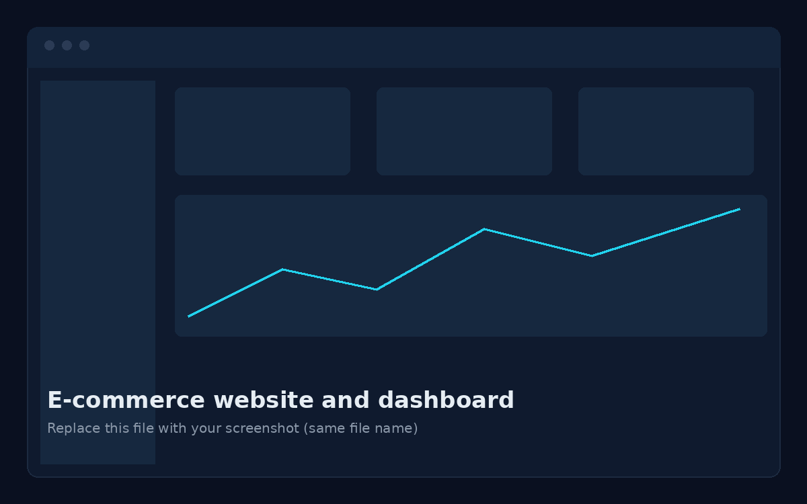
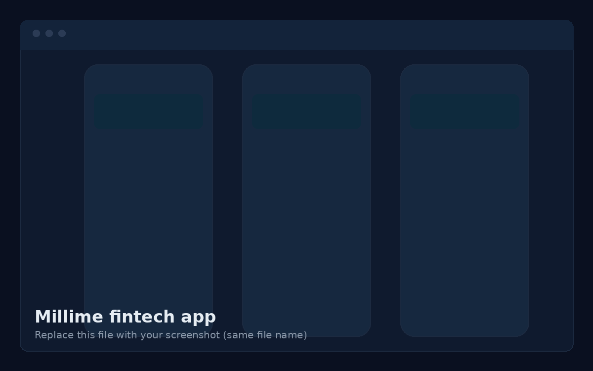
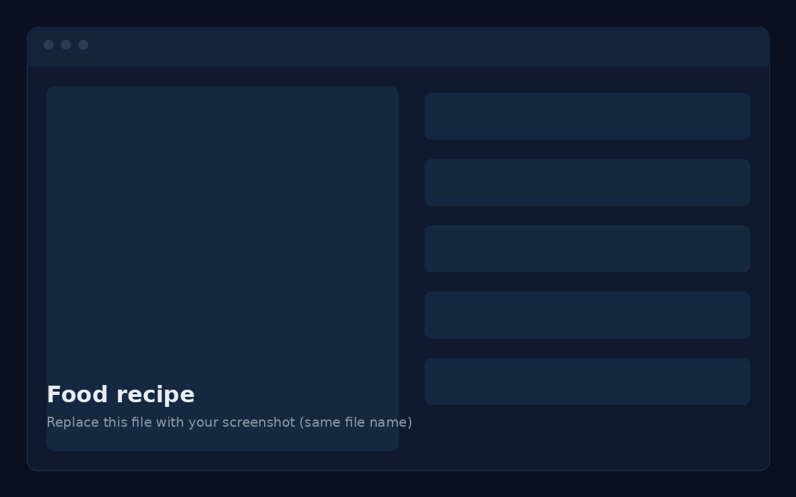
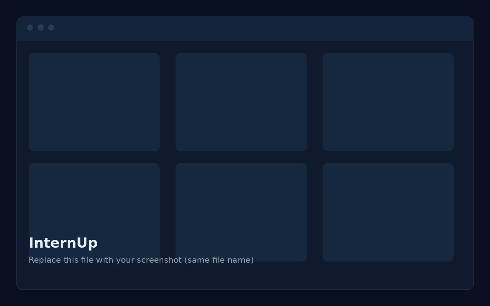

**Computer Science Engineering student at ENICarthage, UI/UX designer and full-stack developer. Tunis, Tunisia.**

## About

I'm a first-year Computer Science Engineering student at ENICarthage, with a licence in information systems development. I design interfaces and build the mobile apps, web apps and backends behind them. I'm also exploring data engineering, AI integration and system architecture.

## Tech stack

<table>
<tr><td width="170"><b>Languages</b></td><td>      </td></tr>
<tr><td width="170"><b>Mobile and cloud</b></td><td>  </td></tr>
<tr><td width="170"><b>Frontend</b></td><td>    </td></tr>
<tr><td width="170"><b>Backend</b></td><td>  </td></tr>
<tr><td width="170"><b>Databases</b></td><td>   </td></tr>
<tr><td width="170"><b>DevOps and tools</b></td><td>   </td></tr>
<tr><td width="170"><b>Design</b></td><td></td></tr>
</table>

## UI/UX design

<table>
<tr><td width="50%" valign="top"> <b>E-commerce website and dashboard</b> Online store with its admin dashboard. Design in Figma. <a href="https://www.figma.com/YOUR-LINK">View case study</a></td><td width="50%" valign="top"> <b>Millime</b> Mobile wallet and payments app. Design in Figma. <a href="https://www.figma.com/YOUR-LINK">View case study</a></td></tr>
<tr><td width="50%" valign="top"> <b>Food recipe</b> Interface design for a recipe product. Design in Figma. <a href="https://www.figma.com/YOUR-LINK">View case study</a></td><td width="50%" valign="top"> <b>InternUp</b> Interface design for the InternUp product. Design in Figma. <a href="https://www.figma.com/YOUR-LINK">View case study</a></td></tr>
</table>

## Development projects

<table>
<tr><td width="170" valign="top"><b>GoDrivTN</b> Mobile app</td><td>Car rental mobile application.     <a href="https://github.com/malakbenothmen/godrivtn">View repository</a></td></tr>
<tr><td width="170" valign="top"><b>CRM Dashboard</b> Web app</td><td>Customer relationship management dashboard to manage quotes, orders and invoices.        <a href="https://github.com/malakbenothmen/crm-dashboard">View repository</a></td></tr>
<tr><td width="170" valign="top"><b>Restaurant website</b> Web app</td><td>Restaurant website with online table reservation.      <a href="https://github.com/malakbenothmen/restaurant-reservation">View repository</a></td></tr>
</table>

## Final year project (PFE)

An AI-powered medical and wellness platform.

[Read the report](./docs/pfe-report.pdf) | [View the presentation](./docs/pfe-presentation.pdf)

## GitHub stats

Show stats

