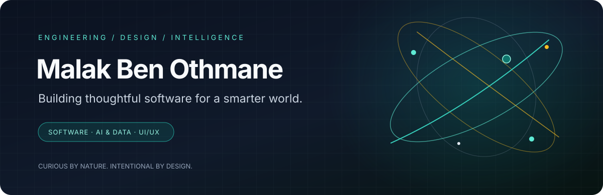

--
  Malak Ben Othmane — GitHub Profile README
  Put this README.md in the PUBLIC repository named exactly: malakbenothmen
  Upload the assets/ folder beside it so the relative image paths work.
-->

 

  

**Software engineering student ·  AI & Data explorer**

*I build useful digital products where thoughtful engineering meets human-centered design.*

---

## `01` — A little about me

Hi, I'm **Malak Ben Othmane** — a computer science engineering student with a software development background and a curiosity for what technology can make possible.

I enjoy moving between the details that make a product work and the details that make it feel right: designing interfaces, shaping backend logic, connecting systems, and exploring how AI can make digital experiences more helpful.

- 🧩 **I build:** web and mobile experiences, APIs, and integrated software products.
- 🧠 **I'm exploring:** AI integration, data engineering, and intelligent systems.
- 🎨 **I care about:** clear architecture, thoughtful UI/UX, and details that make technology easier to use.
- 🌱 **My direction:** growing into an engineer who can connect software, data, and AI to solve real problems.

> *Curiosity starts the idea. Engineering makes it useful.*

## `02` — My technical canvas

### Software & product engineering

### Data, APIs & infrastructure

### Design & product thinking

**Tools and technologies I've worked with include:** Flutter, Dart, Java, Spring Boot, JavaScript, TypeScript, React, Next.js, Python, PostgreSQL, MySQL, Git, REST APIs, and Figma.

**Also explored in projects:** Hono, Bun, Drizzle ORM, Supabase, Neon, GetX, TanStack Query, shadcn/ui, Gemini API, and LiveKit.

*This is a snapshot of my learning and project experience—not a claim of mastery in every tool.*

## `03` — Selected work

### 🩺 Kliniqa — Connected medical tourism platform

An integrated platform concept that brings together medical journeys, communication, accommodation, and wellness experiences in one product.

- **Focus:** full-stack product development, modular architecture, and AI-assisted user experience.
- **My scope:** Flutter patient and doctor experiences, accommodation and wellness flows, and the Super Admin web interface.
- **Stack:** Flutter · Hono · Bun · PostgreSQL · Drizzle · Supabase · LiveKit · Gemini API · Next.js

`Product thinking` `Full-stack` `AI integration` `Modular monolith`

---

### 🛡️ ClaimGuard AI — Healthcare claim pre-validation

A trustworthy AI-assisted workflow for pre-validating healthcare claims, with an emphasis on explainability, evaluation, security, and human review.

- **Focus:** rule-based validation, structured healthcare data, testing, and auditability.
- **What matters:** measure false positives and rule-level performance, route uncertain cases for human review, and keep decisions traceable.
- **Stack:** Python · HL7 FHIR R4 · automated tests · validation and audit workflows

`Healthcare AI` `Quality & evaluation` `Security-minded design`

---

### 💳 Millime — Mobile banking experience

A mobile banking project focused on improving the user experience of financial services and supporting transaction flows.

- **Focus:** mobile development, UI/UX redesign, API integration, and payment-related workflows.
- **Stack:** Flutter · Spring Boot · MySQL · Keycloak

`Fintech` `Mobile UX` `Backend integration`

---

**More than a tech stack: I like understanding the whole product—from the first sketch to the system behind it.**

## `04` — What I'm exploring

| Area | What I'm curious about |
|---|---|
| **AI & Data** | AI integration, data pipelines, trustworthy intelligent features |
| **Software architecture** | Maintainable modules, API design, and reliable system boundaries |
| **Web & mobile** | Accessible interfaces, useful workflows, and polished interactions |
| **UI/UX** | Turning complex tasks into clear, approachable experiences |

I’m especially interested in the space where these areas meet: **building software that is intelligent, reliable, and genuinely useful to people.**

## `05` — A few things I believe

- Good engineering is not just about making something work; it's about making it understandable and maintainable.
- Design is part of the product, not a layer added at the end.
- AI features should be useful, evaluated, and transparent about their limitations.
- The best way to learn is to build, test, reflect, and improve.

## `06` — Let's connect

Have a project, an interesting technical challenge, or an idea worth exploring? I'd be happy to connect.

<a href="https://github.com/malakbenothmen">GitHub</a>
&nbsp; · &nbsp;
<a href="https://www.linkedin.com/">LinkedIn</a>
&nbsp; · &nbsp;
<a href="mailto:YOUR_EMAIL@example.com">Email</a>

  

Designed with curiosity and a little teal glow · © Malak Ben Othmane

