 

- **Millime**: building a Tunisian wallet and payment app, from the screens to the payment backend.
- **ClaimGuard AI**: a review interface for health-claims pre-validation.
- **Engineering degree** at École Nationale d'Ingénieurs de Carthage, after a licence in information systems development.

*Click a card to open it.*

A wallet and payment app for the Tunisian market, designed and built end to end.

- Card top-ups through ClicToPay, with direct credit, held funds and a scheduled release
- Phone recharge for Ooredoo, Tunisie Telecom and Orange: voice or data, top-up or voucher
- Screens in French, English and Arabic
- Started during an internship at Alliance Technologie SA, a Tunisian card and payment systems company

[Repository](https://github.com/YOUR-GITHUB-USERNAME/millime)

A teaching project that checks synthetic health claims before a human reviews them.

- Python rules engine over 600 synthetic claims
- Review interface: dashboard, review queue, claim detail, human decisions and audit log
- Built to support a reviewer, not to decide reimbursements

[Repository](https://github.com/YOUR-GITHUB-USERNAME/claimguard-ai)

A cosmetics website where scrolling drives the story.

- Scroll-triggered scenes with GSAP and ScrollTrigger
- A calm botanical look with slow, cinematic reveals

[Repository](https://github.com/YOUR-GITHUB-USERNAME/botanical)

A UX study of phone recharge in Tunisia, delivered as a working prototype.

- Step-by-step selector: type, mode, operator, amount
- Voice and data, top-up and voucher products

[Repository](https://github.com/YOUR-GITHUB-USERNAME/topup-flow)

I play piano, cut video and follow what AI makes possible. Timing is the same skill in all three.

<b>Open the stats</b>

 

